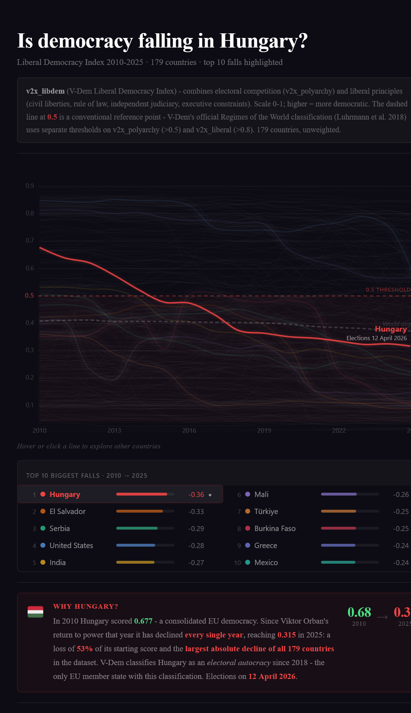

# Is democracy falling in Hungary?

Interactive data visualisation tracking Hungary's democratic decline — the largest of any country over the past 15 years.

**[Live →](https://albrecht-mariz.github.io/hungary-democracy-2026/)**

---

**Data:** V-Dem Institute · Country-Year Core v16 (March 2026) · 179 countries · `v2x_libdem`  
**Stack:** React · D3 · Vite

<!-- TODO: improve mobile layout -->
